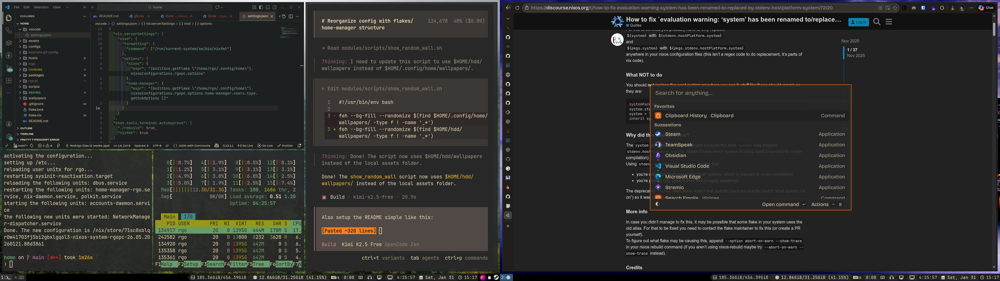

# NixOS & macOS Configuration



This is my personal configuration for both NixOS (desktop) and macOS (MacBook) using flakes and home-manager. Both systems share the same configuration with platform-specific adaptations.

## Features

- **Multi-Platform** - Same configuration works on NixOS (x86_64-linux) and macOS (aarch64-darwin)
- **Flakes** - Modern Nix configuration with flake support
- **Home Manager** - User environment managed as part of the system
- **Modular Structure** - Clean separation:
  - `hosts/` - Host-specific configurations (rgo-desktop, rgo-laptop)
  - `modules/` - All system and app modules
  - `packages/` - Custom packages and overlays
  - `secrets/` - Encrypted secrets with sops-nix
- **i3/Aerospace** - Tiling window manager (i3 on NixOS, Aerospace on macOS)
- **Gruvbox Theme** - Consistent theming across terminal, apps, and desktop
- **Gaming Setup** - Steam, CS2, and various gaming tools (NixOS only)
- **Development Environment** - Full setup for web, mobile, and systems development

## Supported Systems

| System | Platform | Hostname | Window Manager |
|--------|----------|----------|----------------|
| Desktop | NixOS x86_64 | rgo-desktop | i3 |
| Laptop | macOS aarch64 | rgo-laptop | Aerospace |

## Prerequisites

### For macOS (New Machine Setup)

1. **Set up macOS user account** with username `rgo`
2. **Enable FileVault** (recommended for security)
3. **Install Xcode Command Line Tools**:
   ```bash
   xcode-select --install
   ```
4. **Install Homebrew** (needed for secrets and apps):
   ```bash
   /bin/bash -c "$(curl -fsSL https://raw.githubusercontent.com/Homebrew/install/HEAD/install.sh)"
   ```
   Follow the on-screen instructions and add Homebrew to your PATH.

#### macOS: Open apps once

Some macOS apps require being opened manually the first time so you can grant system permissions (Accessibility, Full Disk Access, Screen Recording, Files and Folders, etc.). Open each app once and accept any security prompts so the configuration and integrations apply correctly. Common examples:

- Raycast
- Karabiner
- Aerospace (window manager)
- Syncthing
- JankyBorders
- Other GUI apps that integrate with system permissions

If an app doesn't behave as expected, check System Settings → Privacy & Security and enable the necessary permissions.

## Deployment Guide

### Step 1: SOPS Secrets Setup (Required First!)

Your configuration uses encrypted secrets. You need the age private key to decrypt them.

#### Option A: Copy Existing Key (If you have it)

The private key is usually at:
- NixOS: `~/.config/sops/age/keys.txt` or `~/.age/key.txt`
- macOS: `/Users/rgo/.config/sops/age/keys.txt`

Copy this file to your new machine before proceeding.

#### Option B: Generate New Key and Re-encrypt

If you don't have access to the existing private key:

1. **Generate new age key** on your new machine:
   ```bash
   # macOS - install age first
   brew install age
   
   # Create key directory
   mkdir -p ~/.config/sops/age
   
   # Generate key
   age-keygen -o ~/.config/sops/age/keys.txt
   
   # Get the public key
   cat ~/.config/sops/age/keys.txt | grep "public key"
   # Example output: # public key: age1xxxxx...
   ```

2. **Update `.sops.yaml`** on your existing machine:
   - Edit `secrets/.sops.yaml`
   - Replace the old laptop public key with your new one
   - The file should look like:
     ```yaml
     keys:
       - &desktop age1kh66yknmm78fls7qx8hujmjyprpflq2g44rtrcxd8ln0e4k3m9vqsq8l2h
       - &laptop age1xxxxx... # Your NEW public key
     
     creation_rules:
       - path_regex: (secrets\.yaml|secrets_plain\.yaml)$
         key_groups:
           - age:
               - *desktop
               - *laptop
     ```

3. **Re-encrypt secrets** on existing machine:
   ```bash
   cd ~/.config/home
   sops updatekeys secrets/secrets.yaml
   git add secrets/.sops.yaml secrets/secrets.yaml
   git commit -m "Update laptop age key"
   git push
   ```

4. **Pull updated config** on new machine:
   ```bash
   cd ~/.config/home
   git pull
   ```

**Security Note**: Never commit the private key (the file containing `AGE-SECRET-KEY`). Only the public key (starting with `age1`) goes in `.sops.yaml`.

### Step 2: Install Nix

#### macOS

```bash
# Install Nix (multi-user installation)
sh <(curl --proto '=https' --tlsv1.2 -L https://nixos.org/nix/install)

# Restart terminal or source your shell config
source ~/.zshrc  # or ~/.bashrc

# Verify installation
nix --version

# Enable flakes (required)
mkdir -p ~/.config/nix
echo "experimental-features = nix-command flakes" >> ~/.config/nix/nix.conf

# Note: You may need to restart the Nix daemon for this to take effect:
# sudo launchctl unload /Library/LaunchDaemons/org.nixos.nix-daemon.plist
# sudo launchctl load /Library/LaunchDaemons/org.nixos.nix-daemon.plist
#
# Or just use --extra-experimental-features flag in the next step
```

#### NixOS

Nix is already installed. Just ensure flakes are enabled in your `configuration.nix`:
```nix
nix.settings.experimental-features = [ "nix-command" "flakes" ];
```

### Step 3: Clone Configuration

```bash
git clone https://github.com/yourusername/nix-config.git ~/.config/home
cd ~/.config/home
```

### Step 4: Deploy

#### macOS (rgo-laptop)

**First time only** (installs nix-darwin):
```bash
cd ~/.config/home
# Use this if you get "experimental-features" errors:
nix --extra-experimental-features 'nix-command flakes' run nix-darwin/master#darwin-rebuild -- switch --flake .#rgo-laptop

# Or if flakes are already enabled:
nix run nix-darwin/master#darwin-rebuild -- switch --flake .#rgo-laptop
```

**Subsequent updates**:
```bash
darwin-rebuild switch --flake ~/.config/home#rgo-laptop
```

#### NixOS (rgo-desktop)

**First time only** (new installation):
```bash
cd ~/.config/home
sudo nixos-install --flake .#rgo-desktop
```

**Subsequent updates**:
```bash
sudo nixos-rebuild switch --flake ~/.config/home#rgo-desktop
```

### Step 5: Verify Secrets

After deployment, verify secrets are decrypted:

```bash
# Check age key is in place
cat ~/.config/sops/age/keys.txt

# Secrets should be automatically decrypted by home-manager
# They're available as files in ~/.config/sops/decrypted/
```

## Platform-Specific Details

### What's Different Between Platforms?

| Feature | NixOS (rgo-desktop) | macOS (rgo-laptop) |
|---------|---------------------|-------------------|
| **Window Manager** | i3 (X11) | Aerospace (macOS native) |
| **Package Source** | nixpkgs | nixpkgs + Homebrew |
| **System Services** | systemd | launchd / Homebrew services |
| **Window Borders** | i3 built-in | JankyBorders |
| **Screenshot Tool** | Flameshot | Flameshot (via Homebrew) |
| **Gaming** | Steam, CS2, Wine | Not available |
| **File Sync** | Syncthing (systemd) | Syncthing (Homebrew) |
| **VPN** | Tailscale (service) | Tailscale (Homebrew) |

### Shared Configuration

These are identical on both platforms:
- Shell: Fish with Gruvbox theme, Starship prompt
- Terminal: Ghostty (config via home-manager)
- Editor: Neovim
- Git configuration
- VSCode: settings
- Development tools: Node.js, Python, etc.

### macOS-Specific Apps (Homebrew)

These install via Homebrew on macOS:
- **Aerospace** - Window manager (replaces i3)
- **JankyBorders** - Window borders
- **Raycast** - Launcher
- **Microsoft Edge** - Browser
- **Ghostty** - Terminal
- **Stremio** - Media center
- **TeamSpeak** - Voice chat
- **Beeper** - Messaging
- **Syncthing** - File sync
- **Tailscale** - VPN

### NixOS-Specific Apps

These only work on NixOS:
- i3, bumblebee-status, dunst, redshift
- Flameshot, normcap, charm-freeze
- Steam, gamemode, CS2, Prism Launcher
- OBS, DaVinci Resolve, Darktable
- Solaar (Logitech mouse tool)

## Customization

If you fork this config, change:

1. **Username** in `flake.nix` (currently "rgo")
2. **Age keys** in `secrets/.sops.yaml` (generate your own with `age-keygen`)
3. **Secrets** in `secrets/secrets.yaml` (API keys, passwords, etc.)
4. **System settings** in `hosts/rgo-desktop/` or `hosts/rgo-laptop/`
5. **Personal preferences** in various modules

## Structure

```
.
├── flake.nix              # Main flake configuration
├── hosts/
│   ├── rgo-desktop/      # NixOS desktop configuration
│   │   ├── default.nix
│   │   ├── hardware.nix
│   │   └── hardware-configuration.nix
│   └── rgo-laptop/       # macOS laptop configuration
│       ├── default.nix
│       ├── system.nix
│       └── homebrew.nix
├── modules/
│   ├── constants.nix     # Shared constants (fonts, colors)
│   ├── apps/             # Application modules (cross-platform)
│   ├── core/             # NixOS core modules
│   ├── darwin/           # macOS-specific modules
│   └── scripts/          # Custom scripts
├── packages/             # Custom packages
└── secrets/              # Encrypted secrets
    ├── secrets.yaml
    └── .sops.yaml
```

## Useful Commands

### Rebuild
```bash
# macOS
darwin-rebuild switch --flake ~/.config/home#rgo-laptop

# NixOS
sudo nixos-rebuild switch --flake ~/.config/home#rgo-desktop

# VPS (after NixOS is installed + secrets available)
rebuild-vps
# (reads `rgo_vps_ip` from sops)
# nixos-rebuild switch --flake ~/.config/home#rgo-vps --target-host rgo@$(sops --decrypt --extract '["rgo_vps_ip"]' ~/.config/home/secrets/secrets.yaml)
```

### Hetzner VPS install (nixos-anywhere)
```bash
# First-time install (will wipe the server)
nix run github:nix-community/nixos-anywhere -- \
  --flake .#rgo-vps \
  --target-host root@<server-ip> \
  --build-on local \
  --no-substitute-on-destination
```

### Secrets Management
```bash
# Edit secrets
sops secrets/secrets.yaml

# Add new secret
sops secrets/secrets.yaml
# Then add to secrets/default.nix

# Update keys (after adding new machine)
sops updatekeys secrets/secrets.yaml
```

### Maintenance
```bash
# Update flake inputs
nix flake update

# Check flake
nix flake check

# Garbage collect
nix-collect-garbage -d

# On macOS with nix-darwin
darwin-rebuild switch --flake ~/.config/home#rgo-laptop
```

## Troubleshooting

### macOS: "homebrew" option does not exist
This means you're trying to build a macOS config on NixOS or vice versa. Make sure you're using the correct hostname (`rgo-laptop` for macOS, `rgo-desktop` for NixOS).

### SOPS: "failed to decrypt" errors
- Verify `~/.config/sops/age/keys.txt` exists and contains your private key
- Check that the public key in `.sops.yaml` matches your private key
- Ensure file permissions: `chmod 600 ~/.config/sops/age/keys.txt`

### macOS: "_nixbld1 does not exist" after macOS update
See [NixOS/nix#10892](https://github.com/NixOS/nix/issues/10892) for fix instructions.

### First build takes forever
This is normal - it's downloading and building everything. Subsequent builds will be much faster.

## Credits

Inspired by various NixOS and nix-darwin configurations in the community.
